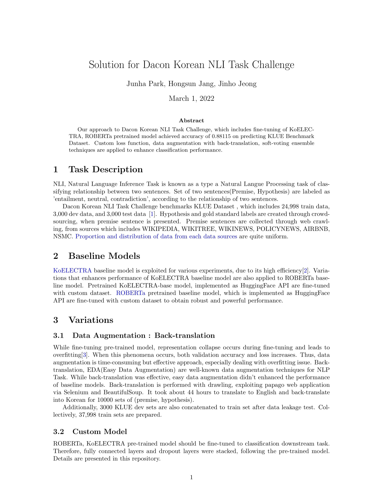

# KorNLI, DACON

*Contributor : Junha Park, Hongsun Jang, Jinho Jeong*, YBIGTA
</img>
</img>

### Current Status of this Repository

---

KorNLI, DACON  
ㄴ📁additional datasets  
ㄴ📁inference_script  
ㄴ📁model_script  
ㄴ📁PDF  
ㄴ📁preprocessing_script  
ㄴ📁submissions_csv  
ㄴREADME. md  

---

📁additional datasets  
- contains KLUE benchmarked dataset
- currently exploiting benchmark_train_data
- also uploaded in google drive

---

📁inference_script  
- contains KoELECTRA model inference & softvoting script

---

📁model_script  
- KoELECTRA(Public 0.822 >> 0.836)
    - only dataset and hyperparms are varied
- KoBERT(Public 0.73) + WanDB

- *Further : Data Augmentation with KoELECTRA*

---

📁preprocessing_script  
- Benchmarking_Data.ipynb
    - script for creating benchmarked data

---

📁submissions_csv  
- All submission .csv files
- Softvoted .csv files from all ensembles
